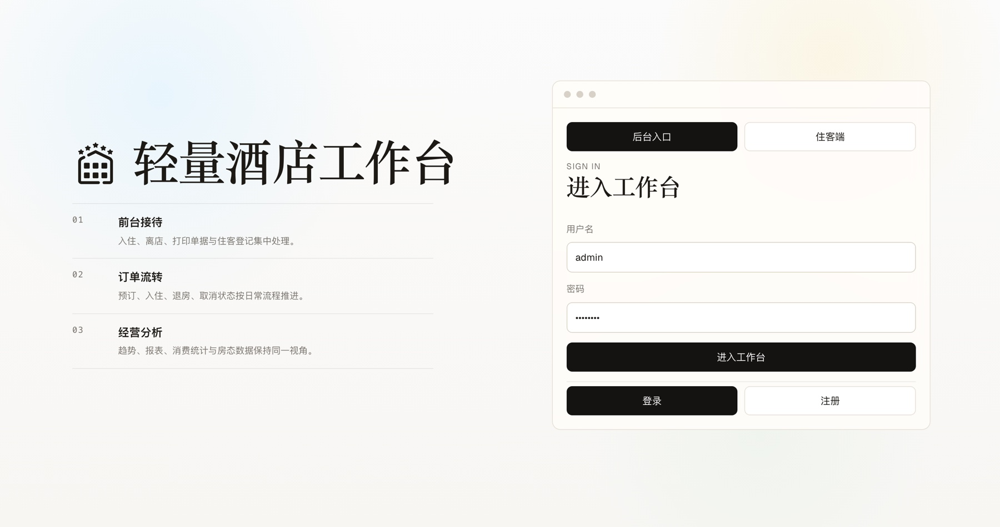
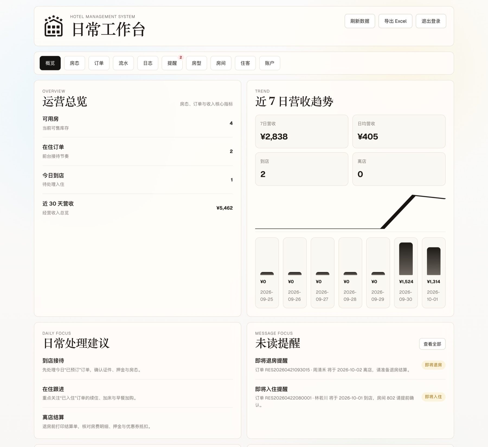
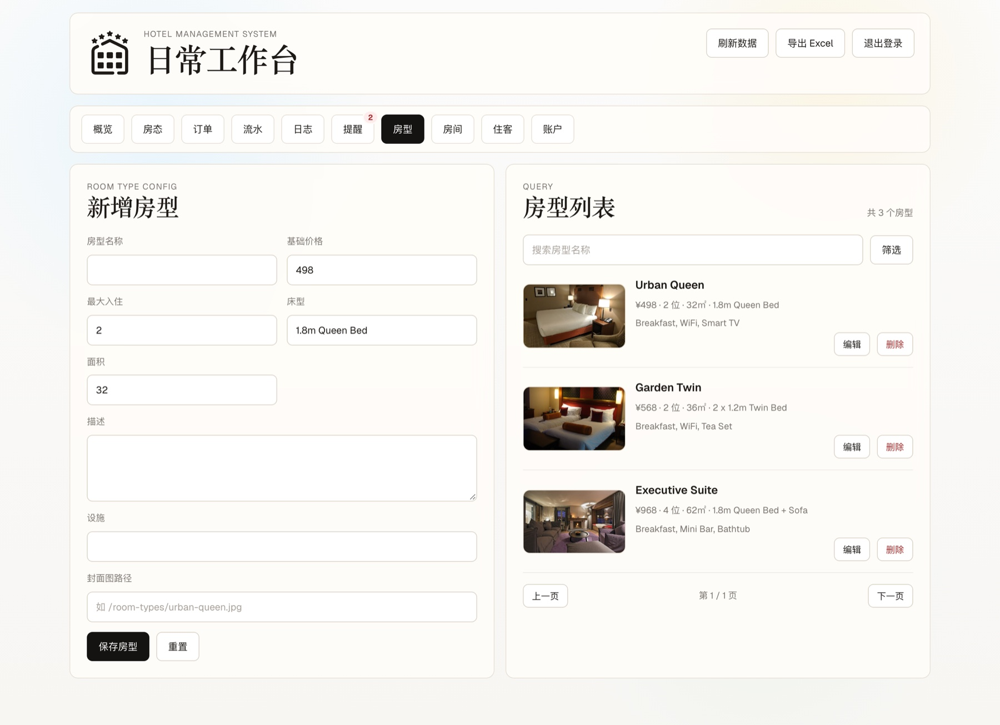
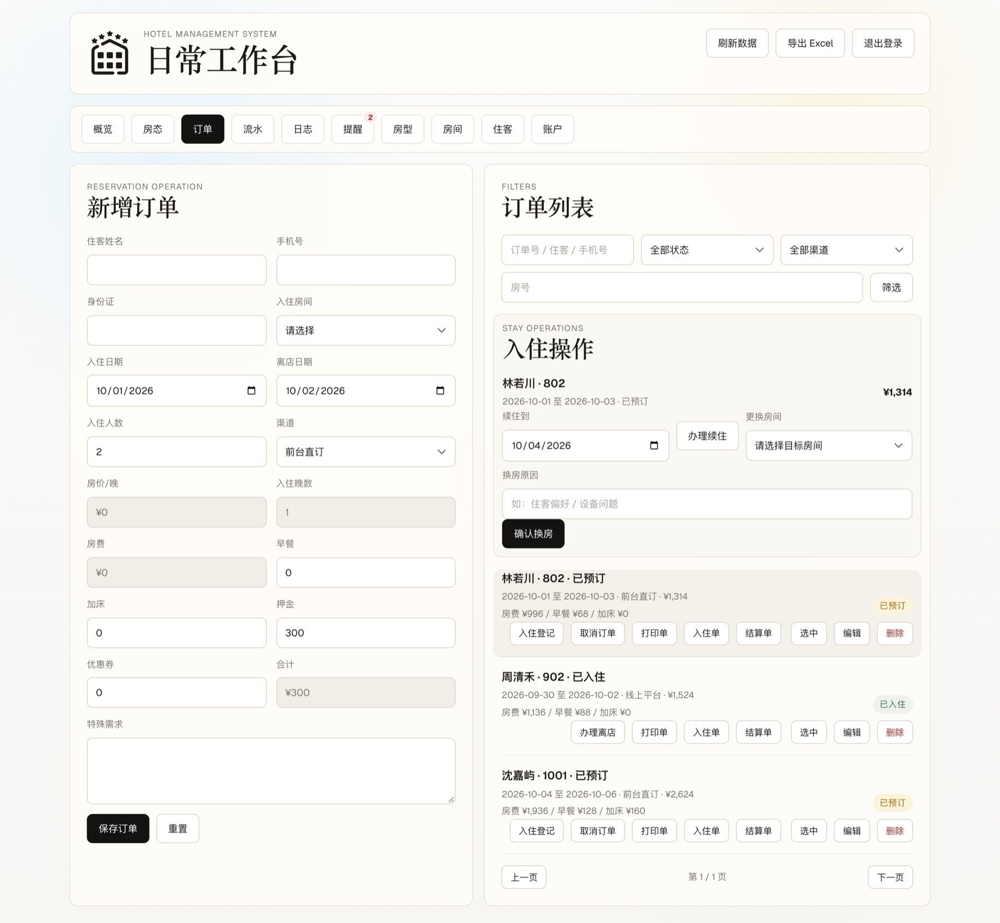
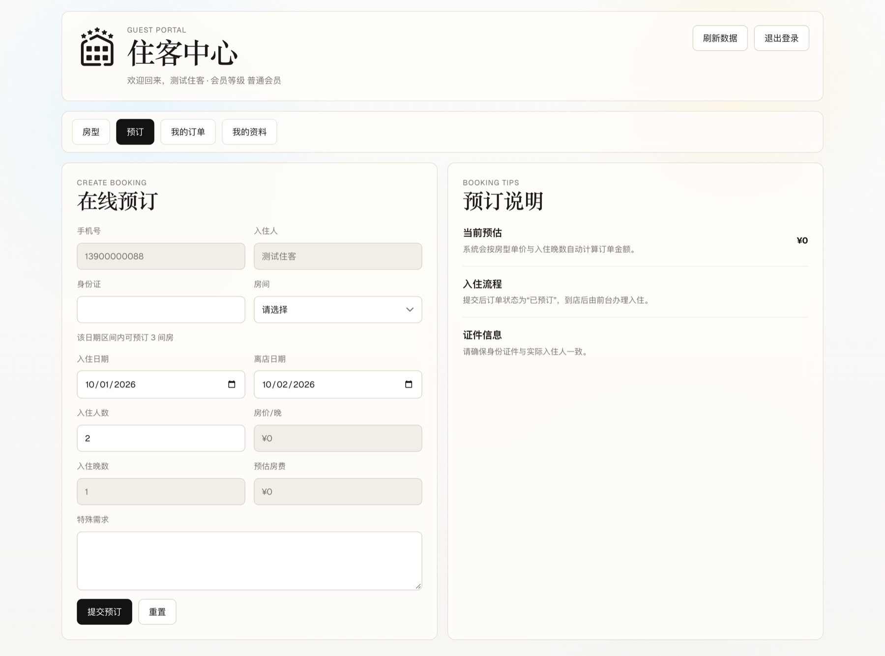
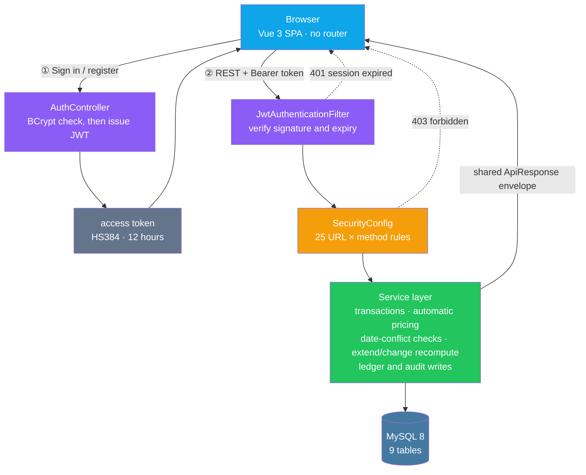

<p align="center"><a href="./README.md">简体中文</a> | <b>English</b></p>

<div align="center">

<picture>
  <source media="(prefers-color-scheme: dark)" srcset="./docs/images/logo-white.png" />
  
</picture>

# Hotel Management System

**A three-role system for day-to-day hotel operations. Room types, rooms, guests, reservations, check-in, check-out, settlement and reporting close the loop on one chain — and admins, front desk and guests are looking at three views of the same data.**

This is not a pile of CRUD pages. What it tries to prove is that **one body of room-occupancy data holds up for all three roles**: the front desk cares about who arrives today, which room is checking out, and whether the settlement slip adds up; the admin cares about inventory, revenue and anomalies; the guest only cares about which rooms are free for *their* three nights and what it costs. So a room being "bookable" is not a field value — it is the result of "this date range does not overlap any existing reservation". That is exactly the part that goes wrong when you read a static status column.

[Changelog](./CHANGELOG.md) &nbsp;·&nbsp; [Database script](./database/hotel_management.sql) &nbsp;·&nbsp; [API contract](#api-contract) &nbsp;·&nbsp; [Disclaimer](#disclaimer-license)

[](backend/pom.xml)
[](frontend/package.json)
[](database/hotel_management.sql)
[](#permission-model)
[](#testing)
[](#testing)

</div>

---

## Preview

<table>
<tr>
<td colspan="2" align="center"></td>
</tr>
<tr>
<td colspan="2" align="center"><sub><b>Sign-in</b> · Staff &amp; guest entry in one page</sub></td>
</tr>
<tr>
<td colspan="2" align="center"></td>
</tr>
<tr>
<td colspan="2" align="center"><sub><b>Admin dashboard</b> · Occupancy and revenue trend</sub></td>
</tr>
<tr>
<td colspan="2" align="center"></td>
</tr>
<tr>
<td colspan="2" align="center"><sub><b>Room types</b> · Cover image and specifications</sub></td>
</tr>
<tr>
<td colspan="2" align="center"></td>
</tr>
<tr>
<td colspan="2" align="center"><sub><b>Reservations</b> · Check-in, extend and change room</sub></td>
</tr>
<tr>
<td colspan="2" align="center"></td>
</tr>
<tr>
<td colspan="2" align="center"><sub><b>Guest portal</b> · Live availability by date</sub></td>
</tr>
</table>

> All five screenshots were taken from a real local run, unretouched. The 4th and 5th are **the same endpoints hitting the same
> room-status table**, rendered for two different roles: an admin sees every reservation plus the front-desk action panel, while
> a guest sees only their own booking entry. The difference is not the page — it is the data scope and the endpoint
> allow-list (see [Permission model](#permission-model)).

---

## Features

### 🏨 One dataset, three roles

Back-office management and guest self-service are not two projects — they are **the same set of endpoints**, trimmed by the role the account holds:

| Role | Sees | Cannot see |
|---|---|---|
| `ADMIN` | Every tab and the full dataset, including account management | — |
| `FRONT_DESK` | Overview, calendar, reservations, guests, ledger, logs, alerts, room types, rooms | Account management (the `/api/v1/**` catch-all admits `ADMIN` only) |
| `CUSTOMER` | Guest portal: room gallery, online booking, my reservations, my profile | Every back-office endpoint |

Tabs are rendered per role, **but the frontend is only the first door**: even if someone hand-crafts a request, that `/api/v1/**` catch-all rule still keeps `FRONT_DESK` out of account management.

### 📅 "Bookable" is a date-range computation, not a field value

The room table has a `status` column (`AVAILABLE` / `OCCUPIED` / `MAINTENANCE`), but **it only blocks out rooms under maintenance**. Whether a given room can be booked for 5–7 October comes from whether it **overlaps** an existing reservation:

```
bookable  ⟺  room.status ≠ MAINTENANCE
          ∧  no active reservation where (checkIn < queryCheckOut) ∧ (checkOut > queryCheckIn)
```

The half-open interval sounds like common sense, but writing `status = 'AVAILABLE'` **permanently** excludes rooms that are occupied *today* — the symptom is that a user booking months ahead silently sees fewer rooms, with no error anywhere.

The cost is a join against the reservation table on every availability query, more expensive than reading one column. That is deliberate: one extra join is cheaper than letting "today's status" decide "what can be booked six months out".

### 🔐 Authorisation converges on the server

`SecurityConfig` holds **25 rules ordered by URL × HTTP method**, running from the most specific (`PUT /api/v1/reservations/*/change-room`) down to the `/api/v1/** → ADMIN` catch-all. The rule table *is* the permission document, so a permission change happens in one place.

Authorisation failures also go through the same response envelope rather than Spring Security's default HTML error page — the frontend interceptor only reads `code`, so it never needs a second parsing branch for 401/403.

### 💰 Costs are stored itemised, not as a single amount

Room charge, breakfast, extra bed, deposit, coupon and the payable total are persisted separately:

```
room charge = nightly rate × nights
order total = room charge + breakfast + extra bed + deposit − coupon
```

Collapsing these into one `amount` column looks tidy, but the moment a guest asks "why was this stay 18 yuan cheaper?" it becomes untraceable. Extending a stay or changing a room recomputes through the same rules and writes the difference into the ledger.

### 🎨 Visual consistency is measurable

Font sizes collapse into 8 steps, control heights into 2 (42 / 34px), radii into 3 — all as CSS variables; inputs and selects share one appearance definition instead of each defining its own. Alignment is not eyeballed either:

- the brand mark and the two-line title are aligned by **ink** (the area the glyphs actually cover); measured error `−0.004px / −0.004px` on top and bottom edges;
- content-sized badges are barred from participating in a parent's stretch or shrink, so they cannot be pulled into an ellipse;
- horizontal overflow is measured page by page across five viewports (see [Testing](#testing)).

---

## Engineering notes: the pits we stepped in

The backend is roughly 5,400 lines of Java and the frontend roughly 3,900 lines of Vue/CSS, but a good share of the rework went into **things that look unimportant and turn out to be critical**. Every entry below was actually hit:

<table>
<tr><th width="30%">Symptom</th><th width="70%">Root cause and fix</th></tr>
<tr>
<td><b>The availability endpoint returns 500 — but only when called without parameters</b></td>
<td><code>@RequestParam</code> is required by default, so a missing parameter throws <code>MissingServletRequestParameterException</code>. Meanwhile the global handler had a single <code>@ExceptionHandler(Exception.class)</code> catch-all that returned <b>500 for every unclassified exception</b>, and even echoed the raw Java exception back to the client.<br/>The fix splits them by semantics: missing parameter / type mismatch / unreadable body → <code>400</code>, unknown path → <code>404</code>, wrong method → <code>405</code>, and the catch-all now only logs and returns a generic message. <b>That kind of catch-all is well-intentioned laziness; the price is that client errors get misread as server crashes during triage.</b></td>
</tr>
<tr>
<td><b>One mistyped word in a path gives a 500 instead of a 404</b></td>
<td>The same catch-all also swallowed <code>NoResourceFoundException</code> — which is what Spring Boot 3 throws when no controller <em>and</em> no static resource matches. Unhandled, <b>any mistyped URL presents itself as a 500</b>.<br/>Where it bit: my smoke test called <code>/customer/profile</code> from memory, but that endpoint does not exist (guest profile lives at <code>/customer/auth/me</code>), so it produced a pile of phantom "server errors".<br/>Lesson: <b>extract real call paths from the frontend code before writing end-to-end cases.</b></td>
</tr>
<tr>
<td><b>Slightly-future bookings cannot see rooms that are obviously free</b></td>
<td>The availability query read <code>r.status = 'AVAILABLE'</code>. <b>Occupancy is a date-range fact</b>, while <code>status</code> only describes "right now": a room occupied today is obviously free six months out, but that predicate excluded it forever.<br/>Changed to <code>r.status &lt;&gt; 'MAINTENANCE'</code>, leaving overlap with existing reservations as the sole occupancy test. Regression-tested four boundaries afterwards: a far-future query returns a currently-occupied room, a hit range is excluded, the checkout day is bookable, and the day before check-in is bookable (no off-by-one on the half-open interval).</td>
</tr>
<tr>
<td><b>One status badge stretched into an ellipse, the other squashed into a circle</b></td>
<td>Two forces at once. A parent flex row defaults to <code>align-items: stretch</code>, which <b>stretches</b> a content-sized badge to the full row height (row height 67.4 with a one-line subtitle versus 87.2 when it wraps, so the badge changed with it) — add a <code>999px</code> radius and it becomes an ellipse or a circle. At the same time the default <code>flex-shrink: 1</code> <b>compresses</b> it horizontally, pushing a four-character label until the text touches the rounded edge.<br/>The fix is <code>.pill { flex: 0 0 auto }</code> plus <code>align-items: center</code> on the <b>container</b>.<br/>⚠️ My first pass lazily added <code>align-self: center</code> to the badge and only afterwards realised the container has another variant that is a <b>column</b> flex — there <code>align-self</code> turns into horizontal alignment and drags the badge from the right edge into the middle. Moved the fix to the container and asserted that mobile boundary specifically.</td>
</tr>
<tr>
<td><b>The action panel's content sits 19px right of the list body below it</b></td>
<td><code>.ops-card</code> is nested inside <code>.panel</code>, and each carries its own padding (24 + 18), so the card's content is indented one level deeper than the list body in the same column. <b>Nested containers accumulate indentation, and each layer looks perfectly reasonable on its own.</b><br/>The fix offsets the card's own padding with a negative margin: <b>the border bleeds outward while the content returns to the grid line</b>, with the bleed distance promoted to a CSS variable. The page now has exactly two alignment lines (12px card bleed / 24px body).<br/>A related problem was fixed at the same time: the left text column's width was decided by <b>how many buttons that row happened to have</b> (303px with three, 391px with five), so subtitles in the same column wrapped at different points.</td>
</tr>
<tr>
<td><b>On narrow screens the room calendar widens the whole page — and the scrollbar never appears</b></td>
<td>The calendar is a grid with a minimum column width of <code>220 + 7 × 94 = 878px</code>. Its container <code>.calendar-table</code> already declared <code>overflow-x: auto</code> — and the scrollbar never showed up.<br/>Because it is a grid item, and <b>grid items default to <code>min-width: auto</code>: they expand to fit their content instead of shrinking to the container</b>. The outer <code>.panel</code> was widened first, the whole page overflowed horizontally, and the inner container's scroll condition could therefore never be satisfied.<br/>The fix declares <code>grid-template-columns: minmax(0, 1fr)</code> on the grid container and lets <code>.panel</code> shrink. After that, 1024 / 768 / 390 went from overflowing by <code>20 / 276 / 637px</code> to zero, and the calendar scrolls <b>inside itself</b> as intended (at 390px the container is 334px against 1045px of content).<br/>⚠️ The signature of this pit: <b>the scrolling style is genuinely correct, it just never takes effect</b> — staring at those few CSS lines reveals nothing. You have to measure <code>scrollWidth</code> against <code>clientWidth</code>.</td>
</tr>
<tr>
<td><b>English errors surfacing inside a Chinese UI</b></td>
<td>The business layer holds roughly 40 English exception messages, which the handler passed straight through and the frontend displayed verbatim.<br/><b>You cannot simply edit those 11 service files</b> — one of them uses <code>"Unauthorized"</code> as a <b>control-flow sentinel</b> (a string comparison decides which failure branch was taken), so changing the wording breaks authentication outright. The correct place is the <b>API boundary</b>: business messages go through a lookup table, and Bean Validation messages are covered by "field label + message-shape regex", so it converges in one spot.</td>
</tr>
<tr>
<td><b><code>localhost:5173</code> logs in, <code>127.0.0.1:5173</code> reports a CORS error</b></td>
<td>The CORS allow-list holds <code>http://localhost:5173</code>. <b>In a browser's eyes <code>localhost</code> and <code>127.0.0.1</code> are two different origins</b>, so the other spelling is a cross-origin request. This failure is especially misleading in automation: the CDP script reported a <code>localStorage SecurityError</code>, which looks like a permissions problem but actually means <b>the page never navigated at all</b>.<br/>The right order is to <code>curl</code> both spellings to check what the server accepts first, and only then suspect the script.</td>
</tr>
<tr>
<td><b>Freshly started front and back ends die the moment you turn around</b></td>
<td>Processes started with <code>nohup npm run dev &amp;</code> hang off the tool's background shell, and <b>the shell reaps its children when it exits</b>. The symptom is "it clearly started but nothing connects", and the log file says nothing at all — check whether anything is listening on the port <em>before</em> deciding to read logs; doing it in the other order wastes the wait.</td>
</tr>
<tr>
<td><b>The Java service was told to use 8080 but came up elsewhere</b></td>
<td>The environment carries a <code>SERVER__PORT</code> variable, Spring Boot's relaxed binding reads it as <code>server.port</code>, and it outranks the config file. Strip it with <code>env -u SERVER__PORT ...</code> at launch, otherwise the frontend reports a pile of incomprehensible errors for what is really just a connection failure.</td>
</tr>
</table>

---

## Architecture



### Permission model

This frontend is a **single page with tab switching** (no vue-router), so there are only two layers of authorisation — but the second one is hard:

| Layer | Location | Effect |
|---|---|---|
| Tabs | tab rendering in `App.vue` | Tabs a role lacks are never rendered, so users see no entry they cannot use |
| Endpoints | the 25 rules in `SecurityConfig` | **Even if the frontend is bypassed and requests are hand-crafted, the server returns no data** |

Both layers use one set of role codes (`ADMIN` / `FRONT_DESK` / `CUSTOMER`); there is no middle ground where "the tab is hidden but the endpoint is open". Rules run from specific to broad, with `/api/v1/**` handing everything else to `ADMIN`.

> Skipping a router is a deliberate trade-off: at this size, tabs match the "workbench" mental model better than routes and save a whole routing-guard layer.
> The cost is that no page has a shareable URL and a refresh returns to the default tab — deep links would be the first thing to add here.

### Data scope

Roles decide *what you may do*; **data scope is decided by the endpoint itself**. The guest-side `/api/v1/customer/reservations` returns only the signed-in guest's own reservations without the frontend sending a `userId`, while the very same `/api/v1/reservations` endpoint shows admins and front desk the whole hotel's records.

---

## Tech stack

| | |
|---|---|
| Backend | Spring Boot 3.3.5 · Java 21 · Spring Security · Spring Validation · MyBatis-Plus 3.5.8 |
| Auth | JJWT 0.12.6 — HS384-signed access token, 12-hour lifetime, stateless verification |
| Database | MySQL 8 (9 tables; `hotel_management` schema) |
| Frontend | Vue 3.5 · Vite 4.5 · plain CSS (no UI component library, no router) |
| Reporting | Apache POI 5.3 (export operation data to Excel) |
| Build | Maven + JDK 21 (backend) / Vite (frontend) |
| Dev proxy | Vite proxies `/api` to `http://localhost:8080`, so the frontend needs no CORS config of its own |

---

## Quick start

### 1. Initialise the database

```bash
# Creates the hotel_management schema, 9 tables, plus roles, room types, rooms and sample data
mysql -uroot -p --default-character-set=utf8mb4 < database/hotel_management.sql
```

> ⚠️ Keep `--default-character-set=utf8mb4`. Importing with the default charset raises no error, but the Chinese text in the seed data (room type names, guest names) turns into mojibake — and <b>it is only visible in the UI</b>; querying from the MySQL CLI looks perfectly fine.

For incremental schema sync, `database/migrations/` holds per-table migration scripts.

### 2. Start the backend

The datasource lives in `backend/src/main/resources/application.yml` (defaults: `root` / `123456` / `localhost:3306`).

```bash
cd backend
env -u SERVER__PORT mvn spring-boot:run        # → http://localhost:8080
```

> If the environment defines `SERVER__PORT`, strip it with `env -u SERVER__PORT`, otherwise Spring Boot's relaxed
> binding reads it as `server.port` and the service never binds 8080.

### 3. Start the frontend

```bash
cd frontend
npm install
npm run dev                                    # → http://localhost:5173
```

Production build check:

```bash
cd frontend && npm run build
```

---

## Default accounts

| Role | Username | Password | What you see after signing in |
|---|---|---|---|
| Administrator | `admin` | `admin123` | Every tab and the full dataset, including account management |
| Front desk | `frontdesk` | `front123` | Overview, calendar, reservations, guests, ledger, logs, alerts, room types, rooms; **no account management** |
| Guest | `13900000088` | `guest123` | Guest portal: room types, online booking, my reservations, my profile |

> Admins and front desk sign in through the staff form (username + password); guests use the guest form (phone + password).
> Guest accounts can also self-register from the sign-in page.

---

## Testing

A full pass was run locally before delivery, covering build, endpoints, permission boundaries, error semantics and layout:

| Check | Scope | Result |
|---|---|---|
| Backend build | `mvn package -DskipTests` | ✅ passed |
| Frontend production build | `npm run build` | ✅ passed (CSS 17.5 kB / JS 145.8 kB) |
| API smoke | auth · business · guest portal · front desk — **43 checks** including error and privilege negative cases | ✅ **43 / 43** |
| Role boundaries | admin / frontdesk / customer × representative endpoints | ✅ matches design (all cross-role calls 403) |
| Error semantics | missing parameter / invalid date / unknown path / wrong method | ✅ 400 / 400 / 404 / 405 |
| Chinese messages | business exceptions and validation messages | ✅ no English left |
| Horizontal overflow | **10 tabs × 5 viewports = 50 checks** (1440 / 1280 / 1024 / 768 / 390) | ✅ **0 overflow** |
| Console errors | 50 page loads | ✅ 0 |

> **An honest note**: the above is human-plus-script verification on a real local run, **not yet distilled into repeatable automated
> cases**, which is why this document offers no `npm test` command. If the project keeps going, two things are worth doing first:
> cover the service layer's pricing and date-conflict logic with `spring-boot-starter-test` on the backend, and pin the
> "role × endpoint" matrix with Playwright on the frontend — the "far-future bookable rooms are missing" defect above is exactly
> the kind only a boundary-date test case catches.

---

## Project structure

```text
Hotel-Management-System
├── backend/                              # Spring Boot 3 backend
│   └── src/main/java/com/example/hotel/
│       ├── config/                       # SecurityConfig (25 auth rules), JWT properties
│       ├── controller/                   # Auth · CustomerAuth · CustomerPortal · Dashboard
│       │                                 # · RoomType · Room · Reservation · Guest
│       │                                 # · Operations · Report · AdminUser
│       ├── service/                      # Business layer: pricing, date conflicts, extend/change recompute
│       ├── security/                     # JWT filter and session resolution
│       ├── entity/ mapper/ dto/ vo/      # Entities, mappers, request / response objects
│       └── exception/                    # Global handler (error semantics + Chinese messages)
├── frontend/                             # Vue 3 frontend (single page + tabs, no router)
│   ├── src/
│   │   ├── App.vue                       # All pages and interaction logic
│   │   └── style.css                     # Design tokens + global styles (single source)
│   └── public/                           # Site icons, brand mark (used as CSS mask), room covers
├── database/
│   ├── hotel_management.sql              # Schema script: 9 tables + sample data
│   └── migrations/                       # Incremental schema scripts
├── docs/
│   ├── images/                           # README brand images (incl. dark-theme variant)
│   ├── screenshots/                      # README preview images
│   └── room-photos.md                    # Room photo sources and licences
├── CHANGELOG.md
└── README.md
```

---

## API contract

### Response envelope

Every endpoint — including failures — returns the same shape:

```json
{
  "success": true,
  "message": "success",
  "data": {}
}
```

Business exceptions are converted by the global handler and authorisation failures by Security's entry point and access-denied handler — so **401 / 403 use this envelope too, not Spring Security's default HTML error page**.

### Pagination

List endpoints accept `pageNo` (default 1) and `pageSize` (default 10):

```json
{
  "success": true,
  "message": "success",
  "data": { "current": 1, "size": 10, "total": 3, "records": [] }
}
```

### Endpoint groups

| Module | Path prefix | Access |
|---|---|---|
| Staff auth | `/api/v1/auth` | Login is public; `/me` for all three roles |
| Guest auth and portal | `/api/v1/customer` | `CUSTOMER` only |
| Operation overview | `/api/v1/dashboard` | `ADMIN` · `FRONT_DESK` |
| Report export | `/api/v1/reports` | `ADMIN` · `FRONT_DESK` |
| Calendar / ledger / logs / alerts | `/api/v1/operations` | `ADMIN` · `FRONT_DESK` |
| Room types | `/api/v1/room-types` | Read: all roles; write: `ADMIN` |
| Rooms | `/api/v1/rooms` | Read: all roles; write: `ADMIN` |
| Reservations | `/api/v1/reservations` | `ADMIN` · `FRONT_DESK` |
| Guest profiles | `/api/v1/guests` | `ADMIN` · `FRONT_DESK` |
| Staff accounts | `/api/v1/users` | `ADMIN` only |

> Full rules in [`SecurityConfig.java`](backend/src/main/java/com/example/hotel/config/SecurityConfig.java) (25 rules).

### Order status

`BOOKED` → `CHECKED_IN` → `CHECKED_OUT`; a `BOOKED` order may also go straight to `CANCELLED`. Status can only advance explicitly along these paths.

---

## Quality boundaries

**Handled**

- Availability is decided by **date-range overlap**, not by reading a static status column; half-open-interval semantics regression-tested on four boundaries.
- Error semantics are layered: client errors (400 / 404 / 405) and server faults (500) are no longer conflated, and the catch-all no longer leaks raw exceptions.
- Chinese throughout: business exceptions, validation messages and authorisation failures are all localised.
- Authorisation failures use the shared envelope, so the frontend needs one parsing path only.
- Order amounts are computed and persisted server-side; client-supplied amounts never participate in settlement.
- Extending a stay or changing a room validates the target room's availability and date conflicts, then recomputes charges and writes to the ledger and audit log.
- Inputs and selects share a single appearance definition; type scale / control heights / radii are consolidated into design tokens.
- Horizontal overflow is zero across 10 tabs × 5 viewports; the brand mark and title are aligned by ink.

**Worth improving**

- **Tests are not codified**: this round relied on manual plus scripted verification, with nothing reusable left behind (see [Testing](#testing)).
- **The CORS allow-list only admits `localhost`**: visiting via `127.0.0.1:5173` or a LAN IP counts as cross-origin, because browsers treat them as different origins. Add the spellings you actually use.
- **The JWT secret and database password sit in `application.yml`**: fine for a local demo, but they should be externalised as environment variables before deployment.
- **No refresh token**: the 12-hour access token simply expires and the user signs in again; there is no silent renewal.
- **No sign-in protection**: no attempt limiting, no CAPTCHA, no rate limiting.
- **No routing**: the single-page tab structure produces no URLs, so pages cannot be shared and a refresh returns to the default tab.
- **Wide tables scroll internally on mobile**: navigation adapts on narrow screens, but wide tables scroll horizontally rather than reflowing into cards.
- **No concurrency guard**: double-booking the same room is prevented by a "check conflict, then insert" pair, which leaves a theoretical race window under load — no lock or unique constraint backstops it.

---

## Documentation

- [Changelog](./CHANGELOG.md)
- [Database script database/hotel_management.sql](./database/hotel_management.sql)
- [Room photo sources](./docs/room-photos.md)

## Disclaimer (License)

This project is intended for learning, coursework and portfolio use. No open-source licence file is included; please contact the author before any other use.

<div align="center"><sub>
The project icon is the "5-star hotel" glyph from <a href="https://icons8.com">Icons8</a>, used under its free licence (the source SVG is a paid format; the repository ships the native PNG bitmap, with no vector redraw).<br/>
UI screenshots come from a real local run and contain no real guest data; room photo sources and licences are listed in <a href="./docs/room-photos.md">docs/room-photos.md</a>.
</sub></div>
