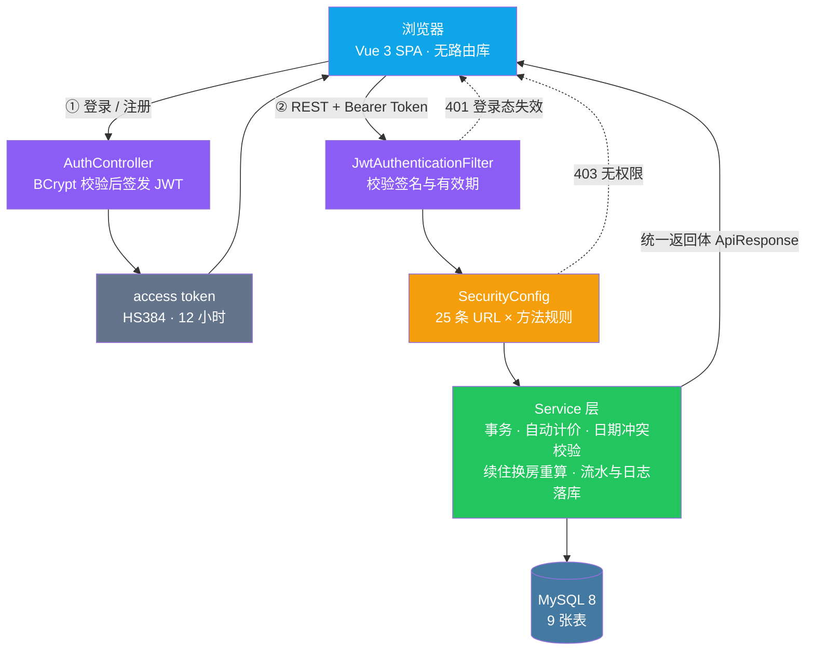

<p align="center"><b>简体中文</b> | <a href="./README.en.md">English</a></p>

<div align="center">

<picture>
  <source media="(prefers-color-scheme: dark)" srcset="./docs/images/logo-white.png" />
  
</picture>

# 轻量酒店工作台

**Hotel Management System**

**面向酒店日常运营的三端协同系统。房型、房间、住客、预订、入住、离店、结算、报表在同一条链路上闭环，管理员、前台与住客看到的是同一份数据的三个视角。**

不是把一堆 CRUD 页面拼在一起。它想验证的是**同一份房态数据在三个角色下都成立**：前台关心的是今天谁到店、哪间房要退、结算单对不对；管理员关心的是库存、营收和异常操作；住客只关心「哪些房在我这三天能订、要多少钱」。所以房间的「可售」不是某个字段的值，而是「在指定日期区间内与已有预约无重叠」这个计算结果 —— 而这一条恰恰是只读静态状态字段时最容易做错的地方。

[更新日志](./CHANGELOG.md) &nbsp;·&nbsp; [数据库脚本](./database/hotel_management.sql) &nbsp;·&nbsp; [接口契约](#api-契约) &nbsp;·&nbsp; [免责与说明](#免责与说明license)

[](backend/pom.xml)
[](frontend/package.json)
[](database/hotel_management.sql)
[](#权限模型)
[](#测试)
[](#测试)

</div>

---

## 预览

<table>
<tr>
<td colspan="2" align="center"></td>
</tr>
<tr>
<td colspan="2" align="center"><sub><b>登录页</b> · 后台 / 住客双入口</sub></td>
</tr>
<tr>
<td colspan="2" align="center"></td>
</tr>
<tr>
<td colspan="2" align="center"><sub><b>管理员工作台</b> · 运营总览与营收趋势</sub></td>
</tr>
<tr>
<td colspan="2" align="center"></td>
</tr>
<tr>
<td colspan="2" align="center"><sub><b>房型管理</b> · 封面图与房型档案</sub></td>
</tr>
<tr>
<td colspan="2" align="center"></td>
</tr>
<tr>
<td colspan="2" align="center"><sub><b>订单管理</b> · 前厅入住、续住与换房</sub></td>
</tr>
<tr>
<td colspan="2" align="center"></td>
</tr>
<tr>
<td colspan="2" align="center"><sub><b>住客中心</b> · 按日期实时查可订房</sub></td>
</tr>
</table>

> 五张图自上而下依次取自本机实机运行，未经修饰。第 4、5 张是**同一批接口、同一张房态表**在两个角色下的
> 渲染结果：管理员看到的是全量订单与前厅操作面板，住客只看到自己的预订入口 —— 差别不在页面，
> 而在数据范围与接口白名单（见[权限模型](#权限模型)）。

---

## 特性

### 🏨 一套数据，三个角色

后台管理与住客自助不是两个项目，而是**同一套接口**按当前账号持有的角色裁剪出来的视图：

| 角色 | 看得到 | 看不到 |
|---|---|---|
| `ADMIN` | 全部菜单与全量数据，含账户管理 | — |
| `FRONT_DESK` | 概览、房态、订单、住客、流水、日志、提醒、房型、房间 | 账户管理（`/api/v1/**` 兜底仅放行 ADMIN） |
| `CUSTOMER` | 住客中心：房型画廊、在线预订、我的订单、我的资料 | 一切后台接口 |

菜单按角色渲染，**但前端只是第一道门**：即使有人手工构造请求，服务端那条 `/api/v1/**` 兜底规则仍会把 `FRONT_DESK` 挡在账户管理之外。

### 📅 「可售」是日期区间的计算结果，不是字段值

房间表里有一个 `status` 字段（`AVAILABLE` / `OCCUPIED` / `MAINTENANCE`），但**它只用来挡维修房**。判断某间房在 10 月 5 日到 7 日能不能订，看的是它与已有预约的**区间是否重叠**：

```
可订  ⟺  房间 status ≠ MAINTENANCE
      ∧  不存在 (checkIn < 查询离店) ∧ (checkOut > 查询入住) 的有效预约
```

这个半开区间看起来是常识，但写成 `status = 'AVAILABLE'` 就会把「今天在住、下个月空着」的房间**永久**排除在可订列表之外 —— 症状是用户订远期房时发现少了几间，而不是报错。

代价是每次查可订房都要 join 预约表，比读一个字段贵。这是有意的：宁可多一次 join，也不要让「今天的状态」决定「半年后能不能订」。

### 🔐 权限在服务端收口

`SecurityConfig` 里是 **25 条按「URL × HTTP 方法」排列的规则**，从最具体的（`PUT /api/v1/reservations/*/change-room`）一路收敛到兜底的 `/api/v1/** → ADMIN`。规则表本身就是权限文档，改权限只改一处。

鉴权失败也走同一套返回体，而不是 Spring Security 默认的 HTML 错误页 —— 前端拦截器只认 `code`，不需要为 401/403 写第二种解析分支。

### 💰 费用拆开存，而不是合并成一个金额

订单里的房费、早餐、加床、押金、优惠券、应收合计是分开落库的：

```
房费     = 房型单价 × 入住晚数
订单合计 = 房费 + 早餐 + 加床 + 押金 − 优惠券
```

合并成单个 `amount` 字段看着干净，但客人问「这单为什么便宜了 18 块」就再也追溯不清。续住和换房时也是按同一套规则重算，并把差额写进财务流水。

### 🎨 视觉一致性是可测量的

字号收成 8 档、控件高度收成 2 档（42 / 34px）、圆角收成 3 档，全部走 CSS 变量；输入框与下拉共用同一套外观定义，不再各写各的。对齐这类事不靠肉眼：

- 品牌图标与两行标题按**墨迹**（字形实际覆盖区域）反算，实测上下沿误差 `−0.004px / −0.004px`；
- 「按内容定尺寸」的徽标禁止参与父容器拉伸与压缩，避免被拉成椭圆；
- 横向溢出在 5 档视口下逐页实测（见[测试](#测试)）。

---

## 工程笔记：那些踩过的坑

这个项目后端约 5,400 行 Java、前端约 3,900 行 Vue/CSS，但相当一部分返工花在了**看起来不重要、实际会要命的地方**。以下每一条都是真实踩过的：

<table>
<tr><th width="30%">症状</th><th width="70%">根因与解法</th></tr>
<tr>
<td><b>查可订房接口返回 500，但带对参数就正常</b></td>
<td><code>@RequestParam</code> 默认必填，缺参数时抛 <code>MissingServletRequestParameterException</code>；而全局异常处理器用一条 <code>@ExceptionHandler(Exception.class)</code> 兜底，把<b>所有未分类异常都当成 500</b> 返回，还把 Java 异常原文吐给前端。<br/>修法是按语义分开：参数缺失 / 类型错误 / 请求体不可读 → <code>400</code>，路径不存在 → <code>404</code>，方法用错 → <code>405</code>，兜底只记日志 + 返回通用文案。<b>这类兜底是「善意的偷懒」，代价是排查时会把客户端错误误判成服务端崩溃。</b></td>
</tr>
<tr>
<td><b>路径写错一个词，接口报 500 而不是 404</b></td>
<td>同一个兜底处理器还会接住 <code>NoResourceFoundException</code> —— Spring Boot 3 对「找不到任何 controller 也没有静态资源」的情况抛的就是它。没有显式处理时，<b>任何拼错的 URL 都会呈现为 500</b>。<br/>踩坑现场：冒烟测试里我凭记忆写了 <code>/customer/profile</code>，这个接口根本不存在（客户资料实际走 <code>/customer/auth/me</code>），于是白报了一堆「服务端异常」。<br/>教训：<b>写端到端用例要先从前端代码里提取真实调用路径，不要凭印象写。</b></td>
</tr>
<tr>
<td><b>远期订房时，几间明明空着的房查不到</b></td>
<td>可订查询 SQL 写的是 <code>r.status = 'AVAILABLE'</code>。<b>占用是日期维度的事</b>，而 <code>status</code> 只描述「此刻」：一间今天在住的房，半年后当然是空的，但它会被这条 SQL 永久排除。<br/>改成 <code>r.status &lt;&gt; 'MAINTENANCE'</code>，占用只由预约区间重叠判定。修完用四组边界回归：远期能返回在住房、命中区间正确排除、退房当天可订、入住前一日可订（半开区间无 off-by-one）。</td>
</tr>
<tr>
<td><b>同一个状态徽标，一个被拉成椭圆、一个被压成正圆</b></td>
<td>两个力同时作用：父级 flex 行默认 <code>align-items: stretch</code>，把按内容定尺寸的徽标<b>纵向拉伸</b>到整行高（副标题一行时行高 67.4、折成两行时 87.2，徽标跟着一起变），再套 <code>999px</code> 圆角就摊成椭圆或正圆；同时默认 <code>flex-shrink: 1</code> 会把它<b>横向压缩</b>，四字标签被挤到文字顶住圆边。<br/>修法是 <code>.pill { flex: 0 0 auto }</code> 并在<b>容器</b>上设 <code>align-items: center</code>。<br/>⚠️ 第一版我图省事给徽标加 <code>align-self: center</code>，写完才想到容器的另一个变体本身是<b>纵向</b> flex —— 那时 <code>align-self</code> 会转成横向对齐，把徽标从右缘拉到中间。已改成在容器上解决，并专门断言了移动端这个边界。</td>
</tr>
<tr>
<td><b>操作区的内容比下方列表正文右移了 19px</b></td>
<td><code>.ops-card</code> 嵌在 <code>.panel</code> 里，两者各有一层内边距（24 + 18），于是卡片内容比同一列下方的列表正文多缩进一层。<b>逐级嵌套的容器会把缩进累加，而每一层单看都「合情合理」。</b><br/>修法是用负外边距抵消卡片自身内边距：<b>边框外扩、内容回到栅格线</b>，并把外扩距离收进一个 CSS 变量。现在全页只有两条对齐线（12px 卡片外扩 / 24px 正文）。<br/>顺带修了同源问题：列表左侧文字列的宽度原本<b>由「这行有几颗按钮」决定</b>（3 颗时 303px、5 颗时 391px），同一列里各行的副标题折行位置对不齐。</td>
</tr>
<tr>
<td><b>窄屏下房态日历把整页撑宽，滚动条却不出现</b></td>
<td>日历是 grid 布局，最小列宽 <code>220 + 7 × 94 = 878px</code>。容器 <code>.calendar-table</code> 其实<b>已经</b>写了 <code>overflow-x: auto</code> —— 但滚动条从没出现过。<br/>原因是它是 grid 子项，而<b>grid 子项默认 <code>min-width: auto</code>，会「被内容撑开」而不是「收缩到容器宽度」</b>：外层 <code>.panel</code> 先被顶宽、整页横向溢出，内层容器的滚动条件就永远不成立。<br/>修法是给网格容器显式声明 <code>grid-template-columns: minmax(0, 1fr)</code>，并让 <code>.panel</code> 允许收缩。修完 1024 / 768 / 390 三档从溢出 <code>20 / 276 / 637px</code> 全部归零，日历在窄屏下正确地<b>内部滚动</b>（390px 时容器 334px、内容 1045px）。<br/>⚠️ 这个坑的特点是：<b>滚动样式确实写对了，只是永远不会生效</b> —— 只盯着那几行 CSS 看不出任何问题，必须量 <code>scrollWidth</code> 与 <code>clientWidth</code> 才知道。</td>
</tr>
<tr>
<td><b>中文界面里弹出英文报错</b></td>
<td>业务层约有 40 条英文异常消息，异常处理器把它们原样返回，前端直接展示。<br/><b>不能直接去改那 11 个业务文件</b> —— 其中 <code>"Unauthorized"</code> 被当作<b>控制流哨兵</b>在使用（靠字符串判断走了哪条失败分支），改文案会直接破坏鉴权流程。正确做法是在 <b>API 边界</b>做一层翻译：业务消息走映射表，Bean Validation 的消息按「字段中文标签 + 句式正则」覆盖，一处收口。</td>
</tr>
<tr>
<td><b><code>localhost:5173</code> 能登录，<code>127.0.0.1:5173</code> 报跨域</b></td>
<td>CORS 白名单配的是 <code>http://localhost:5173</code>。<b>在浏览器眼里 <code>localhost</code> 和 <code>127.0.0.1</code> 是两个不同的 Origin</b>，换种写法访问就是跨域。而且这类失败在自动化里极具迷惑性：CDP 脚本会报 <code>localStorage SecurityError</code>，看起来像权限问题，实际是<b>页面压根没导航成功</b>。<br/>排查顺序应该是：先 <code>curl</code> 两个写法确认服务端放行情况，再怀疑脚本。</td>
</tr>
<tr>
<td><b>刚启动的前后端，转个身就全挂了</b></td>
<td>用 <code>nohup npm run dev &amp;</code> 起的进程挂在工具的后台 shell 下，<b>shell 结束时会把子进程一起回收</b>。表现是「明明起来了却连不上」，而且日志里什么都不写 —— 先看端口有没有人监听，再决定要不要翻日志，顺序反了会白等。</td>
</tr>
<tr>
<td><b>Java 服务指定了 8080，起来却在别的端口</b></td>
<td>环境里存在 <code>SERVER__PORT</code> 变量，Spring Boot 的 relaxed binding 会把它当作 <code>server.port</code>，且优先级高于配置文件。启动前 <code>env -u SERVER__PORT ...</code> 摘掉它，否则前端会因为连不上而报一堆看不懂的错。</td>
</tr>
</table>

---

## 架构



### 权限模型

这个前端是**单页 + 标签切换**（没有引入 vue-router），所以鉴权只有两层，但第二层是硬的：

| 层 | 位置 | 作用 |
|---|---|---|
| 菜单 | `App.vue` 的标签渲染 | 无权限的标签不渲染，用户看不到进不去的入口 |
| 接口 | `SecurityConfig` 的 25 条规则 | **即使前端被绕过、请求被手工构造，服务端也不会返回数据** |

两层用的是同一组角色码（`ADMIN` / `FRONT_DESK` / `CUSTOMER`），不存在「菜单藏了但接口没管」的中间态。规则从具体到宽泛排列，最后由 `/api/v1/**` 兜底给 `ADMIN`。

> 不引入路由库是有意的取舍：这个体量下，标签切换比路由更贴近「工作台」的心智模型，也省掉了一套路由守卫。
> 代价是没有 URL 可分享、刷新后回到默认标签 —— 如果需要深链接，这里是要补的第一件事。

### 数据范围

角色决定「能做什么」，**数据范围则由接口本身决定**：住客端的 `/api/v1/customer/reservations` 只返回当前登录住客自己的订单，不需要前端传 `userId`。同一个 `/api/v1/reservations` 接口，管理员和前台看到的是全店流水。

---

## 技术栈

| | |
|---|---|
| 后端 | Spring Boot 3.3.5 · Java 21 · Spring Security · Spring Validation · MyBatis-Plus 3.5.8 |
| 认证 | JJWT 0.12.6 —— HS384 签名的 access token，有效期 12 小时，无状态校验 |
| 数据库 | MySQL 8（9 张表；`hotel_management` 库） |
| 前端 | Vue 3.5 · Vite 4.5 · 原生 CSS（无 UI 组件库、无路由库） |
| 报表 | Apache POI 5.3（运营数据导出 Excel） |
| 构建 | Maven + JDK 21（后端） / Vite（前端） |
| 开发代理 | Vite 把 `/api` 代理到 `http://localhost:8080`，前端不单独配跨域 |

---

## 快速开始

### 1. 初始化数据库

```bash
# 建库 hotel_management、9 张表，并写入角色、房型、房间与示例业务数据
mysql -uroot -p --default-character-set=utf8mb4 < database/hotel_management.sql
```

> ⚠️ 建议带上 `--default-character-set=utf8mb4`。用默认字符集导入不会报错，但初始化数据里的中文（房型名、住客姓名）会变成乱码 —— 而且<b>只在界面上看得出来</b>，SQL 命令行里查完全正常。

需要按增量方式同步结构时，`database/migrations/` 下另有单表迁移脚本。

### 2. 启动后端

数据库连接在 `backend/src/main/resources/application.yml`（默认 `root` / `123456` / `localhost:3306`）。

```bash
cd backend
env -u SERVER__PORT mvn spring-boot:run        # → http://localhost:8080
```

> 如果环境里存在 `SERVER__PORT`，用 `env -u SERVER__PORT` 摘掉它，否则 Spring Boot 的 relaxed binding
> 会把它当成 `server.port`，服务不会监听在 8080。

### 3. 启动前端

```bash
cd frontend
npm install
npm run dev                                    # → http://localhost:5173
```

生产构建检查：

```bash
cd frontend && npm run build
```

---

## 默认账号

| 角色 | 账号 | 密码 | 登录后能看到什么 |
|---|---|---|---|
| 系统管理员 | `admin` | `admin123` | 全部菜单与全量数据，含账户管理 |
| 前台专员 | `frontdesk` | `front123` | 概览、房态、订单、住客、流水、日志、提醒、房型、房间；**无账户管理** |
| 住客 | `13900000088` | `guest123` | 住客中心：房型、在线预订、我的订单、我的资料 |

> 管理员与前台走后台登录（用户名 + 密码），住客走住客端登录（手机号 + 密码）。
> 住客账号也可以在登录页自助注册。

---

## 测试

交付前在本机实机跑过一轮，覆盖构建、接口、权限边界、错误语义与布局：

| 检查项 | 规模 | 结果 |
|---|---|---|
| 后端编译打包 | `mvn package -DskipTests` | ✅ 通过 |
| 前端生产构建 | `npm run build` | ✅ 通过（CSS 17.5 kB / JS 145.8 kB） |
| 接口冒烟 | 认证 · 业务 · 客户门户 · 前厅共 **43 项**（含异常与越权负例） | ✅ **43 / 43** |
| 角色权限边界 | admin / frontdesk / customer × 代表接口 | ✅ 与设计一致（越权均 403） |
| 错误语义 | 缺参数 / 非法日期 / 不存在路径 / 方法用错 | ✅ 分别 400 / 400 / 404 / 405 |
| 中文提示 | 业务异常与参数校验消息 | ✅ 无英文残留 |
| 页面横向溢出 | **10 个标签页 × 5 档视口 = 50 项**（1440 / 1280 / 1024 / 768 / 390） | ✅ **0 项溢出** |
| 控制台报错 | 50 项页面加载 | ✅ 0 条 |

> **诚实说明**：以上是交付前的人工 + 脚本实机验证，**尚未固化成可重复运行的自动化用例**，因此本文档不提供
> `npm test` 之类的命令。如果这个项目要继续维护，建议优先补两件事：后端用 `spring-boot-starter-test`
> 覆盖 Service 层的计价与日期冲突校验，前端用 Playwright 把「角色 × 接口」的权限矩阵钉住 ——
> 上面那条「远期可订房查不到」的缺陷，正是只有把边界日期写进用例才抓得住的类型。

---

## 目录结构

```text
Hotel-Management-System
├── backend/                              # Spring Boot 3 后端
│   └── src/main/java/com/example/hotel/
│       ├── config/                       # SecurityConfig（25 条鉴权规则）、JWT 配置
│       ├── controller/                   # Auth · CustomerAuth · CustomerPortal · Dashboard
│       │                                 # · RoomType · Room · Reservation · Guest
│       │                                 # · Operations · Report · AdminUser
│       ├── service/                      # 业务层：自动计价、日期冲突校验、续住换房重算
│       ├── security/                     # JWT 过滤器与登录态解析
│       ├── entity/ mapper/ dto/ vo/      # 实体、Mapper、请求 / 响应对象
│       └── exception/                    # 统一异常处理（含错误语义分层与中文文案）
├── frontend/                             # Vue 3 前端（单页 + 标签切换，无路由库）
│   ├── src/
│   │   ├── App.vue                       # 全部页面与交互逻辑
│   │   └── style.css                     # 设计令牌 + 全局样式（唯一来源）
│   └── public/                           # 站点图标、品牌图（CSS mask 用）、房型封面图
├── database/
│   ├── hotel_management.sql              # 建库脚本：9 张表 + 示例数据
│   └── migrations/                       # 增量结构脚本
├── docs/
│   ├── images/                           # README 品牌图（含深色主题版）
│   ├── screenshots/                      # README 预览图
│   └── room-photos.md                    # 房型图片素材来源与许可
├── CHANGELOG.md
└── README.md
```

---

## API 契约

### 统一返回体

所有接口（含异常）都返回同一结构：

```json
{
  "success": true,
  "message": "success",
  "data": {}
}
```

业务异常由全局异常处理器转换，鉴权失败由 Security 的入口点与拒绝处理器转换 —— 所以 **401 / 403 也是这个结构，而不是 Spring Security 默认的 HTML 错误页**。

### 分页约定

列表接口统一支持 `pageNo`（默认 1）与 `pageSize`（默认 10）：

```json
{
  "success": true,
  "message": "success",
  "data": { "current": 1, "size": 10, "total": 3, "records": [] }
}
```

### 接口分组

| 模块 | 路径前缀 | 权限 |
|---|---|---|
| 后台认证 | `/api/v1/auth` | 登录接口公开；`/me` 三端均可 |
| 住客认证与门户 | `/api/v1/customer` | 仅 `CUSTOMER` |
| 经营概览 | `/api/v1/dashboard` | `ADMIN` · `FRONT_DESK` |
| 报表导出 | `/api/v1/reports` | `ADMIN` · `FRONT_DESK` |
| 房态 / 流水 / 日志 / 提醒 | `/api/v1/operations` | `ADMIN` · `FRONT_DESK` |
| 房型 | `/api/v1/room-types` | 读：三端；写：`ADMIN` |
| 房间 | `/api/v1/rooms` | 读：三端；写：`ADMIN` |
| 订单 | `/api/v1/reservations` | `ADMIN` · `FRONT_DESK` |
| 住客档案 | `/api/v1/guests` | `ADMIN` · `FRONT_DESK` |
| 后台账户 | `/api/v1/users` | 仅 `ADMIN` |

> 完整规则见 [`SecurityConfig.java`](backend/src/main/java/com/example/hotel/config/SecurityConfig.java)（25 条）。

### 订单状态

`BOOKED` 已预订 → `CHECKED_IN` 已入住 → `CHECKED_OUT` 已退房；`BOOKED` 可直接 `CANCELLED` 取消。状态只能沿既有路径显式推进。

---

## 质量边界

**已处理**

- 可订房按**日期区间重叠**判定，而不是读静态状态字段；半开区间语义经四组边界回归。
- 错误语义分层：客户端错误（400 / 404 / 405）与服务端异常（500）不再混为一谈，兜底不再泄露异常原文。
- 全站中文文案：业务异常、参数校验消息、鉴权失败提示均已汉化。
- 鉴权失败走统一返回体，前端只需一套解析逻辑。
- 订单金额由服务端计算并落库，前端传入的金额不参与结算。
- 续住 / 换房会校验目标房间的可用性与日期冲突，并重算费用、写流水与操作日志。
- 输入控件与下拉共用同一套外观定义；字号 / 控件高度 / 圆角收敛为设计令牌。
- 10 个标签页 × 5 档视口横向溢出为 0；品牌图标与标题按墨迹对齐。

**仍可增强**

- **测试未固化**：本轮验证靠人工 + 脚本，没有沉淀成可重复运行的用例（见[测试](#测试)）。
- **CORS 白名单只放行 `localhost`**：用 `127.0.0.1:5173` 或局域网 IP 访问会被判跨域。浏览器视二者为不同 Origin，需要按实际访问方式补白名单。
- **JWT 密钥与数据库口令直接写在 `application.yml`**：本地演示够用，部署时应外置为环境变量。
- **没有刷新令牌**：access token 12 小时到期后需重新登录，没有静默续期。
- **缺少登录保护**：没有失败次数限制、验证码或接口限流。
- **无路由**：单页标签结构不产生 URL，页面不可分享、刷新后回到默认标签。
- **移动端宽表格内部横向滚动**：窄屏下导航已改为自适应，但宽表格本身仍是横向滚动而非卡片化。
- **无并发保护**：同一房间的重复预订靠「查冲突 + 写入」两步完成，高并发下理论上存在竞态窗口，未加锁或唯一约束兜底。

---

## 文档

- [更新日志 CHANGELOG](./CHANGELOG.md)
- [数据库脚本 database/hotel_management.sql](./database/hotel_management.sql)
- [房型图片素材来源](./docs/room-photos.md)

## 免责与说明（License）

本项目用于学习、课程设计与作品集展示场景，未附开源协议文件；如需用于其它用途请先联系作者。

<div align="center"><sub>
项目图标采用 <a href="https://icons8.com">Icons8</a> 的「5 星级酒店」图标，遵循其免费许可（源 SVG 为付费格式，仓库内为原生 PNG 位图，未做矢量化重绘）。<br/>
界面截图取自本机实机运行，未包含任何真实住客数据；房型照片来源与许可见 <a href="./docs/room-photos.md">docs/room-photos.md</a>。
</sub></div>
